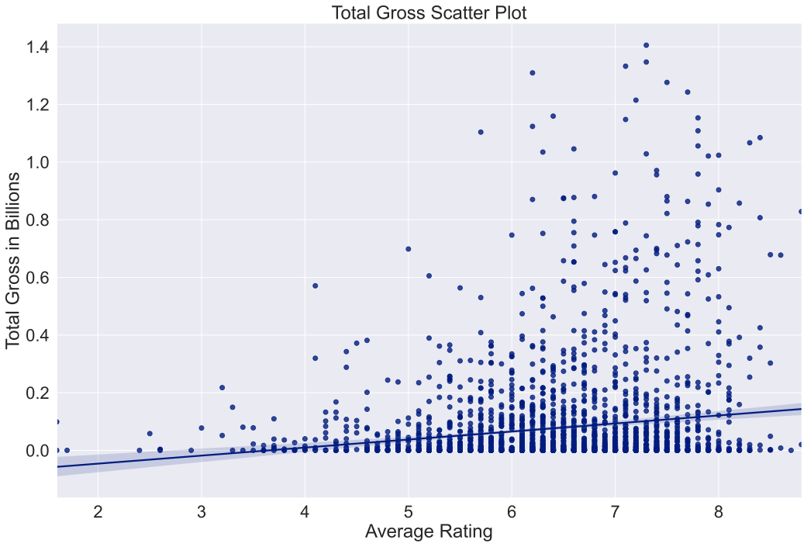
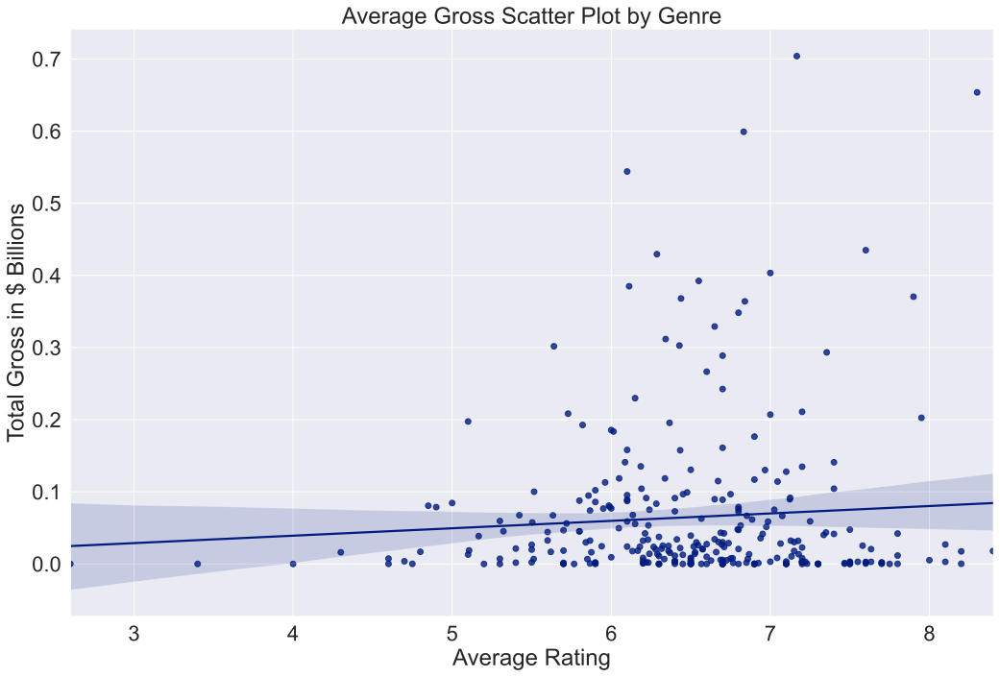
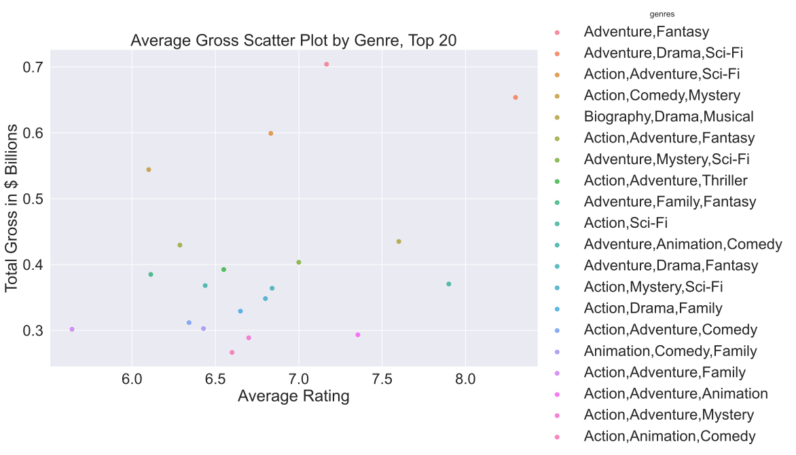
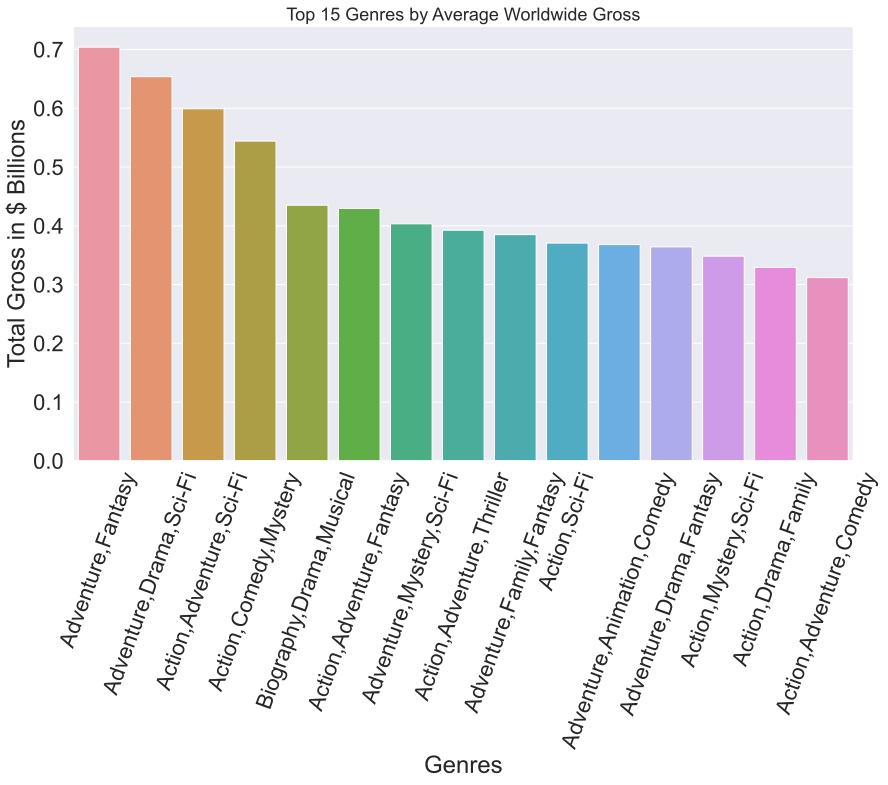
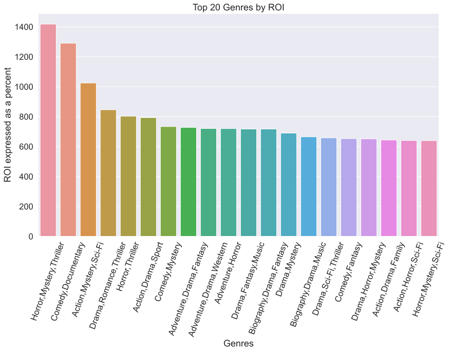

# Microsoft Movie Market Analysis

### J.D.Denney

### Part 1, Introduction

#### Microsoft, the client, has tasked our firm with the analysis of film industry data in order to determine trends and provide insights into their movie making ventures. All analysis and subsequent recommendations will be key to their initial efforts at penetrating the market.

#### Let's first pull in the data and took a look at it. 


```python
#import libraries
import numpy as np
import pandas as pd
import matplotlib.pyplot as plt
import seaborn as sns
%matplotlib inline
# import sqlite3

# current issues - 1. there are duplicate titles, as many as 4 duplicates for 'The Door' in df_clean  
```


```python
#initial pull of data with pandas read of title basics csv to get a feel for the data
dfbscs = pd.read_csv(r"C:\Users\josep\Desktop\CourseWork\phase_1\Phase1\MovieProject\zippedData\imdb.title.basics.csv.gz")
pd.options.display.float_format = '{:.3f}'.format # to remove the scientific notation for very large numbers and format everything to 3 decimal places
```

### We've imported our first data and formated any float objects in our dataframes moving forward. What does a quick look at the first five rows tell us? 

### imdb.title.basics.csv gives us access to the titles of the movie, what genre it is, as well as runtime and start year. 


```python
dfbscs.head()
```


<div>
<style scoped>
    .dataframe tbody tr th:only-of-type {
        vertical-align: middle;
    }

    .dataframe tbody tr th {
        vertical-align: top;
    }

    .dataframe thead th {
        text-align: right;
    }
</style>
<table border="1" class="dataframe">
  <thead>
    <tr style="text-align: right;">
      <th></th>
      <th>tconst</th>
      <th>primary_title</th>
      <th>original_title</th>
      <th>start_year</th>
      <th>runtime_minutes</th>
      <th>genres</th>
    </tr>
  </thead>
  <tbody>
    <tr>
      <th>0</th>
      <td>tt0063540</td>
      <td>Sunghursh</td>
      <td>Sunghursh</td>
      <td>2013</td>
      <td>175.000</td>
      <td>Action,Crime,Drama</td>
    </tr>
    <tr>
      <th>1</th>
      <td>tt0066787</td>
      <td>One Day Before the Rainy Season</td>
      <td>Ashad Ka Ek Din</td>
      <td>2019</td>
      <td>114.000</td>
      <td>Biography,Drama</td>
    </tr>
    <tr>
      <th>2</th>
      <td>tt0069049</td>
      <td>The Other Side of the Wind</td>
      <td>The Other Side of the Wind</td>
      <td>2018</td>
      <td>122.000</td>
      <td>Drama</td>
    </tr>
    <tr>
      <th>3</th>
      <td>tt0069204</td>
      <td>Sabse Bada Sukh</td>
      <td>Sabse Bada Sukh</td>
      <td>2018</td>
      <td>nan</td>
      <td>Comedy,Drama</td>
    </tr>
    <tr>
      <th>4</th>
      <td>tt0100275</td>
      <td>The Wandering Soap Opera</td>
      <td>La Telenovela Errante</td>
      <td>2017</td>
      <td>80.000</td>
      <td>Comedy,Drama,Fantasy</td>
    </tr>
  </tbody>
</table>
</div>


```python
# Let's pull in the other two recommended databases to take a look at what is going on. 
dfrtngs = pd.read_csv(r"C:\Users\josep\Desktop\CourseWork\phase_1\Phase1\MovieProject\zippedData\imdb.title.ratings.csv.gz", sep='\t')
dfgrss = pd.read_csv(r"C:\Users\josep\Desktop\CourseWork\phase_1\Phase1\MovieProject\zippedData\bom.movie_gross.csv.gz", sep='\t')               
```


```python
# And get some info on each of them while taking a look at their size and datatypes. 
# tconst column will be a key between basics and ratings, while title will be a bit trickier
# of a key between basics and movie gross dataframes
dfbscs.info()
dfrtngs.info()
dfgrss.info()
```

    <class 'pandas.core.frame.DataFrame'>
    RangeIndex: 146144 entries, 0 to 146143
    Data columns (total 6 columns):
     #   Column           Non-Null Count   Dtype  
    ---  ------           --------------   -----  
     0   tconst           146144 non-null  object 
     1   primary_title    146144 non-null  object 
     2   original_title   146123 non-null  object 
     3   start_year       146144 non-null  int64  
     4   runtime_minutes  114405 non-null  float64
     5   genres           140736 non-null  object 
    dtypes: float64(1), int64(1), object(4)
    memory usage: 6.7+ MB
    <class 'pandas.core.frame.DataFrame'>
    RangeIndex: 73856 entries, 0 to 73855
    Data columns (total 3 columns):
     #   Column         Non-Null Count  Dtype  
    ---  ------         --------------  -----  
     0   tconst         73856 non-null  object 
     1   averagerating  73856 non-null  float64
     2   numvotes       73856 non-null  int64  
    dtypes: float64(1), int64(1), object(1)
    memory usage: 1.7+ MB
    <class 'pandas.core.frame.DataFrame'>
    RangeIndex: 3387 entries, 0 to 3386
    Data columns (total 5 columns):
     #   Column          Non-Null Count  Dtype  
    ---  ------          --------------  -----  
     0   title           3387 non-null   object 
     1   studio          3382 non-null   object 
     2   domestic_gross  3359 non-null   float64
     3   foreign_gross   2037 non-null   object 
     4   year            3387 non-null   int64  
    dtypes: float64(1), int64(1), object(3)
    memory usage: 132.4+ KB
    

### Some of these dataFrames have a lot of rows of data, some have much less. There's a lot going on here, but let's first make sure that we clean up all of the data that will be used to provide insights and make recommendations to Microsoft.


```python
dfbscs.head()
```


<div>
<style scoped>
    .dataframe tbody tr th:only-of-type {
        vertical-align: middle;
    }

    .dataframe tbody tr th {
        vertical-align: top;
    }

    .dataframe thead th {
        text-align: right;
    }
</style>
<table border="1" class="dataframe">
  <thead>
    <tr style="text-align: right;">
      <th></th>
      <th>tconst</th>
      <th>primary_title</th>
      <th>original_title</th>
      <th>start_year</th>
      <th>runtime_minutes</th>
      <th>genres</th>
    </tr>
  </thead>
  <tbody>
    <tr>
      <th>0</th>
      <td>tt0063540</td>
      <td>Sunghursh</td>
      <td>Sunghursh</td>
      <td>2013</td>
      <td>175.000</td>
      <td>Action,Crime,Drama</td>
    </tr>
    <tr>
      <th>1</th>
      <td>tt0066787</td>
      <td>One Day Before the Rainy Season</td>
      <td>Ashad Ka Ek Din</td>
      <td>2019</td>
      <td>114.000</td>
      <td>Biography,Drama</td>
    </tr>
    <tr>
      <th>2</th>
      <td>tt0069049</td>
      <td>The Other Side of the Wind</td>
      <td>The Other Side of the Wind</td>
      <td>2018</td>
      <td>122.000</td>
      <td>Drama</td>
    </tr>
    <tr>
      <th>3</th>
      <td>tt0069204</td>
      <td>Sabse Bada Sukh</td>
      <td>Sabse Bada Sukh</td>
      <td>2018</td>
      <td>nan</td>
      <td>Comedy,Drama</td>
    </tr>
    <tr>
      <th>4</th>
      <td>tt0100275</td>
      <td>The Wandering Soap Opera</td>
      <td>La Telenovela Errante</td>
      <td>2017</td>
      <td>80.000</td>
      <td>Comedy,Drama,Fantasy</td>
    </tr>
  </tbody>
</table>
</div>


```python
dfrtngs.head()
```


<div>
<style scoped>
    .dataframe tbody tr th:only-of-type {
        vertical-align: middle;
    }

    .dataframe tbody tr th {
        vertical-align: top;
    }

    .dataframe thead th {
        text-align: right;
    }
</style>
<table border="1" class="dataframe">
  <thead>
    <tr style="text-align: right;">
      <th></th>
      <th>tconst</th>
      <th>averagerating</th>
      <th>numvotes</th>
    </tr>
  </thead>
  <tbody>
    <tr>
      <th>0</th>
      <td>tt10356526</td>
      <td>8.300</td>
      <td>31</td>
    </tr>
    <tr>
      <th>1</th>
      <td>tt10384606</td>
      <td>8.900</td>
      <td>559</td>
    </tr>
    <tr>
      <th>2</th>
      <td>tt1042974</td>
      <td>6.400</td>
      <td>20</td>
    </tr>
    <tr>
      <th>3</th>
      <td>tt1043726</td>
      <td>4.200</td>
      <td>50352</td>
    </tr>
    <tr>
      <th>4</th>
      <td>tt1060240</td>
      <td>6.500</td>
      <td>21</td>
    </tr>
  </tbody>
</table>
</div>


```python
dfgrss.head()
```


<div>
<style scoped>
    .dataframe tbody tr th:only-of-type {
        vertical-align: middle;
    }

    .dataframe tbody tr th {
        vertical-align: top;
    }

    .dataframe thead th {
        text-align: right;
    }
</style>
<table border="1" class="dataframe">
  <thead>
    <tr style="text-align: right;">
      <th></th>
      <th>title</th>
      <th>studio</th>
      <th>domestic_gross</th>
      <th>foreign_gross</th>
      <th>year</th>
    </tr>
  </thead>
  <tbody>
    <tr>
      <th>0</th>
      <td>Toy Story 3</td>
      <td>BV</td>
      <td>415000000.000</td>
      <td>652000000</td>
      <td>2010</td>
    </tr>
    <tr>
      <th>1</th>
      <td>Alice in Wonderland (2010)</td>
      <td>BV</td>
      <td>334200000.000</td>
      <td>691300000</td>
      <td>2010</td>
    </tr>
    <tr>
      <th>2</th>
      <td>Harry Potter and the Deathly Hallows Part 1</td>
      <td>WB</td>
      <td>296000000.000</td>
      <td>664300000</td>
      <td>2010</td>
    </tr>
    <tr>
      <th>3</th>
      <td>Inception</td>
      <td>WB</td>
      <td>292600000.000</td>
      <td>535700000</td>
      <td>2010</td>
    </tr>
    <tr>
      <th>4</th>
      <td>Shrek Forever After</td>
      <td>P/DW</td>
      <td>238700000.000</td>
      <td>513900000</td>
      <td>2010</td>
    </tr>
  </tbody>
</table>
</div>


```python
df_ratings = pd.merge(dfbscs,dfrtngs, on='tconst') # titles without ratings doesnt tell us much - full merge these two dataframes and then inspect df_ratings
df_ratings
# quick check to see if numbers fall in reasonable parameters
print(df_ratings['averagerating'].max()) # = 10
print(df_ratings['averagerating'].min()) # = 1.0
print(df_ratings['start_year'].max()) # = 2019
print(df_ratings['start_year'].min()) # = 2010
# merging data allows for a single consolidated list and removes any titles that do not have an
# average rating or numvotes
# can then merge the new df with dfgrss to get gross amounts
# but have to change the column headings on dfbscs first to title from primary title

```

    10.0
    1.0
    2019
    2010
    


```python
# create a new df, df_clean that can merge on column 'title' after renaming the column from 'primary_title' with the gross box office figures in dfgrss 
df_clean = df_ratings.rename(columns = {'primary_title':'title'})
df_clean = df_clean.sort_values(by=['numvotes'],axis=0,ascending=False,ignore_index=False)
df_clean = df_clean.drop_duplicates(subset='title') # after deleting duplicates for df_ratings_and_gross, decided to come and further clean up df_clean
print(len(df_clean))
# check for duplicate titles, verify that "The Door" has multiple entries

# *****want to remove duplicate titles with the least numvotes this is temp debugging code, comment off later
# 
# duplicates = df_clean[df_clean.duplicated(subset='title')]
# print(len(duplicates))
# print(duplicates.head())
# for x in df_clean['title']:
#     if x=='The Door':
#         print(x)
# *****     

df_ratings_and_gross = pd.merge(df_clean,dfgrss, on='title')
# we now have two sets of data - one 3027 (df_ratings_and_gross) rows long that contains ratings, genres,
# and domestic and foreign gross. The other data set has 73856 records, (df_clean) in it which 
# can still provide data on overall ratings. 
# There is still some data cleaning to do before we begin visualizing the data. 
# additionally, one set contains foreign gross which is set to a sting datatype, it will need
# to be converted to a float object

# since there are duplicates in the data, I want to sort the df and have the title with the most numvotes first and drop the rest of the duplicates in order to accomplish this

df_ratings_and_gross = df_ratings_and_gross.sort_values(by=['numvotes'],axis=0,ascending=False,ignore_index=False)
# now we can utilize .drop_duplicates on the titles column in order to remove all duplicate titles while keeping the title with the most num votes. 
print(df_ratings_and_gross)
df_ratings_and_gross = df_ratings_and_gross.drop_duplicates(subset='title')
print(df_ratings_and_gross) # note that rows have decreased to 2598 from 3027 after deleting duplicate titles. 
```

    69993
             tconst                    title           original_title  start_year  \
    0     tt1375666                Inception                Inception        2010   
    1     tt1345836    The Dark Knight Rises    The Dark Knight Rises        2012   
    2     tt0816692             Interstellar             Interstellar        2014   
    3     tt1853728         Django Unchained         Django Unchained        2012   
    4     tt0993846  The Wolf of Wall Street  The Wolf of Wall Street        2013   
    ...         ...                      ...                      ...         ...   
    2594  tt8851190                      Red                      Red        2018   
    2595  tt1666555              Anchor Baby              Anchor Baby        2010   
    2596  tt1692325           Eyes Wide Open           Eyes Wide Open        2010   
    2597  tt3436064         The Last Station       La última estación        2012   
    2598  tt2713406                 Meerkats                 Meerkats        2011   
    
          runtime_minutes                   genres  averagerating  numvotes  \
    0             148.000  Action,Adventure,Sci-Fi          8.800   1841066   
    1             164.000          Action,Thriller          8.400   1387769   
    2             169.000   Adventure,Drama,Sci-Fi          8.600   1299334   
    3             165.000            Drama,Western          8.400   1211405   
    4             180.000    Biography,Crime,Drama          8.200   1035358   
    ...               ...                      ...            ...       ...   
    2594           90.000                    Drama          8.100        26   
    2595           95.000           Drama,Thriller          7.000        25   
    2596          110.000      Documentary,History          8.700        17   
    2597           90.000              Documentary          7.600        10   
    2598           40.000              Documentary          7.400         7   
    
         studio  domestic_gross foreign_gross  year  
    0        WB   292600000.000     535700000  2010  
    1        WB   448100000.000     636800000  2012  
    2      Par.   188000000.000     489400000  2014  
    3     Wein.   162800000.000     262600000  2012  
    4      Par.   116900000.000     275100000  2013  
    ...     ...             ...           ...   ...  
    2594   Sum.    90400000.000     108600000  2010  
    2595    AGF       15800.000        161000  2011  
    2596    NAV       26300.000        250000  2010  
    2597    SPC     6600000.000       6900000  2010  
    2598    NGE      778000.000        482000  2012  
    
    [2599 rows x 12 columns]
             tconst                    title           original_title  start_year  \
    0     tt1375666                Inception                Inception        2010   
    1     tt1345836    The Dark Knight Rises    The Dark Knight Rises        2012   
    2     tt0816692             Interstellar             Interstellar        2014   
    3     tt1853728         Django Unchained         Django Unchained        2012   
    4     tt0993846  The Wolf of Wall Street  The Wolf of Wall Street        2013   
    ...         ...                      ...                      ...         ...   
    2594  tt8851190                      Red                      Red        2018   
    2595  tt1666555              Anchor Baby              Anchor Baby        2010   
    2596  tt1692325           Eyes Wide Open           Eyes Wide Open        2010   
    2597  tt3436064         The Last Station       La última estación        2012   
    2598  tt2713406                 Meerkats                 Meerkats        2011   
    
          runtime_minutes                   genres  averagerating  numvotes  \
    0             148.000  Action,Adventure,Sci-Fi          8.800   1841066   
    1             164.000          Action,Thriller          8.400   1387769   
    2             169.000   Adventure,Drama,Sci-Fi          8.600   1299334   
    3             165.000            Drama,Western          8.400   1211405   
    4             180.000    Biography,Crime,Drama          8.200   1035358   
    ...               ...                      ...            ...       ...   
    2594           90.000                    Drama          8.100        26   
    2595           95.000           Drama,Thriller          7.000        25   
    2596          110.000      Documentary,History          8.700        17   
    2597           90.000              Documentary          7.600        10   
    2598           40.000              Documentary          7.400         7   
    
         studio  domestic_gross foreign_gross  year  
    0        WB   292600000.000     535700000  2010  
    1        WB   448100000.000     636800000  2012  
    2      Par.   188000000.000     489400000  2014  
    3     Wein.   162800000.000     262600000  2012  
    4      Par.   116900000.000     275100000  2013  
    ...     ...             ...           ...   ...  
    2594   Sum.    90400000.000     108600000  2010  
    2595    AGF       15800.000        161000  2011  
    2596    NAV       26300.000        250000  2010  
    2597    SPC     6600000.000       6900000  2010  
    2598    NGE      778000.000        482000  2012  
    
    [2598 rows x 12 columns]
    


```python
# change foreign gross to a float obj
df_ratings_and_gross['foreign_gross'] = pd.to_numeric(df_ratings_and_gross['foreign_gross'],errors='coerce')
# in this ~3000 records dataset, we need to look for outliers or invalid data. look 
# for max, mins in float data. nothing stands out
print(df_ratings_and_gross['averagerating'].max()) # = 9.2
print(df_ratings_and_gross['averagerating'].min()) # = 1.6
print(df_ratings_and_gross['year'].max()) # = 2018
print(df_ratings_and_gross['year'].min()) # = 2010
print(df_ratings_and_gross['start_year'].max()) # = 2019
print(df_ratings_and_gross['start_year'].min()) # = 2010
```

    8.8
    1.6
    2018
    2010
    2019
    2010
    

#### I want to also make sure that all NaN values are ignored when proceeding with the data. Keeping in mind that there are NaN values still present in the data, let's move forward 
#### and answer some questions about the data and what it means. 

### Part 2, Question 1

#### Does a longer runtime indicate a lower average rating? Should Microsoft have a target movie length range for their projects? 


```python
# For this initial question, we need to ignore NaN values in average rating. In addition to excluding
# NaN values, there are some movies with high or low ratings but very few votes - this could mean
# that the average ratings are higher or lower than they would otherwise be with more reviewers. 
# For that reason, I will exclude data with 10 votes or fewer when comparing the data. (data minimum number of votes is 5)
```


```python
# create new df to call for lmplot
data_df = df_clean[['runtime_minutes','averagerating','numvotes']]
# filter for numvotes less than 10
df_over_ten = data_df[data_df.numvotes > 10]
# filter for movie outliers with ridiculous lengths
df_over_ten = df_over_ten[df_over_ten.runtime_minutes <= 400]
df_over_ten = df_over_ten.dropna()
# we have removed all rows with a NaN present. Additionally, we can see that we have 
# excluded data that has less than 6 votes that are contributing to the rating. 
print(df_over_ten)
# count values to take another look at the data
df_over_ten['runtime_minutes'].value_counts().sort_values()
print(df_over_ten.corr())
# also standard deviation for runtime minutes to figure out a good range for their movie length!
df_over_ten.mean()
df_over_ten.std()
# 68% of movies are produced within 22 minutes of a 95 minute average.
```

    runtime_minutes  averagerating  numvotes
    2387           148.000          8.800   1841066
    2241           164.000          8.400   1387769
    280            169.000          8.600   1299334
    12072          165.000          8.400   1211405
    325            143.000          8.100   1183655
    ...                ...            ...       ...
    30670           85.000          6.500        11
    30560           45.000          5.900        11
    11947          102.000          6.300        11
    11502           89.000          7.600        11
    34460          240.000          8.500        11
    
    [52456 rows x 3 columns]
                     runtime_minutes  averagerating  numvotes
    runtime_minutes            1.000          0.018     0.125
    averagerating              0.018          1.000     0.066
    numvotes                   0.125          0.066     1.000
    


    runtime_minutes      22.422
    averagerating         1.431
    numvotes          35847.867
    dtype: float64


```python
# drop numvotes column from df_over_five and create an lmplot in seaborn
df_plot1 = df_over_ten.drop(columns=['numvotes'])
# plot lmplot
sns.set(font_scale=2)
sns.set_style("darkgrid")
palette = sns.set_palette("dark")
ax = sns.lmplot(x='runtime_minutes',y='averagerating',data=df_plot1,height=10,aspect=15/10)
ax.set(xlabel="Runtime in Minutes",ylabel="Average Movie Rating")
plt.title('Average Rating vs. Total Runtime')
plt.show()
```


### Question 1 Insights
#### There is no readily apparent correlation between total runtime and the average rating of a movie based on the information in the data tables. Microsoft should focus on making movies within 1 standard deviation (+/- 22 minutes) of the mean of 95 minutes.  


```python
df_plot1.corr()
# as we can see, there is no correlation between runtime_minutes and averagerating
```


<div>
<style scoped>
    .dataframe tbody tr th:only-of-type {
        vertical-align: middle;
    }

    .dataframe tbody tr th {
        vertical-align: top;
    }

    .dataframe thead th {
        text-align: right;
    }
</style>
<table border="1" class="dataframe">
  <thead>
    <tr style="text-align: right;">
      <th></th>
      <th>runtime_minutes</th>
      <th>averagerating</th>
    </tr>
  </thead>
  <tbody>
    <tr>
      <th>runtime_minutes</th>
      <td>1.000</td>
      <td>0.018</td>
    </tr>
    <tr>
      <th>averagerating</th>
      <td>0.018</td>
      <td>1.000</td>
    </tr>
  </tbody>
</table>
</div>


### Part 3, Question 2

#### What can we learn by looking at the correlation between total gross and the average
#### rating of a movie? Put slightly differently, does a higher quality movie demand more 
#### money at the BO?


```python
# just as a reminder, here is what the table we will be working with for question 2 looks like
df_ratings_and_gross.info()
```

    <class 'pandas.core.frame.DataFrame'>
    Int64Index: 2598 entries, 0 to 2598
    Data columns (total 12 columns):
     #   Column           Non-Null Count  Dtype  
    ---  ------           --------------  -----  
     0   tconst           2598 non-null   object 
     1   title            2598 non-null   object 
     2   original_title   2598 non-null   object 
     3   start_year       2598 non-null   int64  
     4   runtime_minutes  2598 non-null   float64
     5   genres           2598 non-null   object 
     6   averagerating    2598 non-null   float64
     7   numvotes         2598 non-null   int64  
     8   studio           2595 non-null   object 
     9   domestic_gross   2581 non-null   float64
     10  foreign_gross    1554 non-null   float64
     11  year             2598 non-null   int64  
    dtypes: float64(4), int64(3), object(5)
    memory usage: 263.9+ KB
    


```python
# For this question, we will look at a graphical representation of the average rating
# plotted agains the total gross (domestic_gross + foreign_gross)
# sum foreign and domestic into new column, ignoring NaN values of which there could result in # a max of 17 (2598 total rows less 2581 values in doomestic gross)
df_ratings_and_gross['total_gross'] = df_ratings_and_gross['domestic_gross'].fillna(0)+df_ratings_and_gross['foreign_gross'].fillna(0)
df_ratings_and_gross # but how many of the total gross are 0 after adding a NaN from both 
# domestic/foreign columns
df_ratings_and_gross.isna().sum()
df_ratings_and_gross['total_gross'].value_counts()
df_ratings_and_gross['total_gross']=df_ratings_and_gross['total_gross']/1000000000
# great, we can see that total gross has 0 elements that show NaN, as predicted, which is what we need.
# If a movie had NaN in both domestic and foreign gross then it is showing a value of 0 in total gross.
# after checking for value counts == 0 we can see that we have only good data in the total gross column,
# assuming that all NaN's were meant to be 0's. For domestic gross, that is hard to assume, as it would 
# be unusual but not impossible for a movie to make money abroad but not in its home country. 
```


```python
# plot graph of average rating vs total gross
sns.set(font_scale=2)
sns.set_style("darkgrid")
palette = sns.set_palette("dark")
ax = sns.lmplot(x='averagerating',y=('total_gross'),data=df_ratings_and_gross,height=10,aspect=15/10)
ax.set(xlabel="Average Rating",ylabel="Total Gross in Billions")
plt.ticklabel_format(style='plain',axis='y')
plt.title('Total Gross Scatter Plot')
plt.show()
# issue here is y axis label with 1e9 top left, make it prettier
df_plot2 = df_ratings_and_gross.drop(columns=['start_year','runtime_minutes','numvotes','year'])
```





### Question 2 Insights
#### As seen in the graph above and the correlation table below, there is only a slight correlation between average rating and the total gross of a movie. The higher quality a movie is, the more likely it is to gross more at the box office. We still haven't hit on a truly valuable insight for the client.


```python
df_plot2.corr()
```


<div>
<style scoped>
    .dataframe tbody tr th:only-of-type {
        vertical-align: middle;
    }

    .dataframe tbody tr th {
        vertical-align: top;
    }

    .dataframe thead th {
        text-align: right;
    }
</style>
<table border="1" class="dataframe">
  <thead>
    <tr style="text-align: right;">
      <th></th>
      <th>averagerating</th>
      <th>domestic_gross</th>
      <th>foreign_gross</th>
      <th>total_gross</th>
    </tr>
  </thead>
  <tbody>
    <tr>
      <th>averagerating</th>
      <td>1.000</td>
      <td>0.154</td>
      <td>0.186</td>
      <td>0.147</td>
    </tr>
    <tr>
      <th>domestic_gross</th>
      <td>0.154</td>
      <td>1.000</td>
      <td>0.826</td>
      <td>0.920</td>
    </tr>
    <tr>
      <th>foreign_gross</th>
      <td>0.186</td>
      <td>0.826</td>
      <td>1.000</td>
      <td>0.978</td>
    </tr>
    <tr>
      <th>total_gross</th>
      <td>0.147</td>
      <td>0.920</td>
      <td>0.978</td>
      <td>1.000</td>
    </tr>
  </tbody>
</table>
</div>


### Part 4, Question 3

What genre of films gross the most at the box office (BO)? What other insights can we gather from looking into this?


```python
# We will need to break out the genres and list them separately for all films where there 
# are multiple genres listed.
# df_ratings_and_gross has total gross in it from our previous exercise
len(df_ratings_and_gross['genres'].unique())
# let's separate these out
```


    296


```python
df_ratings_and_gross.info()
```

    <class 'pandas.core.frame.DataFrame'>
    Int64Index: 2598 entries, 0 to 2598
    Data columns (total 13 columns):
     #   Column           Non-Null Count  Dtype  
    ---  ------           --------------  -----  
     0   tconst           2598 non-null   object 
     1   title            2598 non-null   object 
     2   original_title   2598 non-null   object 
     3   start_year       2598 non-null   int64  
     4   runtime_minutes  2598 non-null   float64
     5   genres           2598 non-null   object 
     6   averagerating    2598 non-null   float64
     7   numvotes         2598 non-null   int64  
     8   studio           2595 non-null   object 
     9   domestic_gross   2581 non-null   float64
     10  foreign_gross    1554 non-null   float64
     11  year             2598 non-null   int64  
     12  total_gross      2598 non-null   float64
    dtypes: float64(5), int64(3), object(5)
    memory usage: 284.2+ KB
    


```python
# need to separate genres out into a list and count total occurences 
# see above for list of unique genre combinations - there are too many to put together an insightful
# histogram with. 
#genres_list = df_ratings_and_gross['genres'].dropna().str.lower().str.split(',').to_list()
#g_list = []

#for genre_list in genres_list:
#    try:
#        g_list.extend(genre_list)
#    except:
#        continue
```


```python
# Raf dummify genres example
# df_example = pd.get_dummies(df_ratings_and_gross['genres'].str.split(',').apply(pd.Series).stack()).sum(level=0)
```

### Lets group our data by genres, including those where genres are combined and look at what the averages of the data can show us. 


```python
df_genres = df_ratings_and_gross.groupby(df_ratings_and_gross['genres']).mean().reset_index()
# let's graph the top 20 of 
# this for total_gross and single out some genres (and genre combinations) that are generally more 
# successful. 
df_genres2 = df_genres.sort_values('total_gross',axis=0,ascending=False).reset_index()
df_genres2.head(15) # we can see hear the top 15 grossing genres or combination of genres
```


<div>
<style scoped>
    .dataframe tbody tr th:only-of-type {
        vertical-align: middle;
    }

    .dataframe tbody tr th {
        vertical-align: top;
    }

    .dataframe thead th {
        text-align: right;
    }
</style>
<table border="1" class="dataframe">
  <thead>
    <tr style="text-align: right;">
      <th></th>
      <th>index</th>
      <th>genres</th>
      <th>start_year</th>
      <th>runtime_minutes</th>
      <th>averagerating</th>
      <th>numvotes</th>
      <th>domestic_gross</th>
      <th>foreign_gross</th>
      <th>year</th>
      <th>total_gross</th>
    </tr>
  </thead>
  <tbody>
    <tr>
      <th>0</th>
      <td>106</td>
      <td>Adventure,Fantasy</td>
      <td>2013.333</td>
      <td>139.667</td>
      <td>7.167</td>
      <td>375770.333</td>
      <td>192899999.667</td>
      <td>511133333.333</td>
      <td>2013.333</td>
      <td>0.704</td>
    </tr>
    <tr>
      <th>1</th>
      <td>101</td>
      <td>Adventure,Drama,Sci-Fi</td>
      <td>2014.500</td>
      <td>156.500</td>
      <td>8.300</td>
      <td>989725.000</td>
      <td>208200000.000</td>
      <td>445550000.000</td>
      <td>2014.500</td>
      <td>0.654</td>
    </tr>
    <tr>
      <th>2</th>
      <td>11</td>
      <td>Action,Adventure,Sci-Fi</td>
      <td>2013.978</td>
      <td>131.370</td>
      <td>6.833</td>
      <td>428425.130</td>
      <td>238628260.848</td>
      <td>385655813.953</td>
      <td>2014.000</td>
      <td>0.599</td>
    </tr>
    <tr>
      <th>3</th>
      <td>30</td>
      <td>Action,Comedy,Mystery</td>
      <td>2018.000</td>
      <td>121.000</td>
      <td>6.100</td>
      <td>1250.000</td>
      <td>2000000.000</td>
      <td>542100000.000</td>
      <td>2018.000</td>
      <td>0.544</td>
    </tr>
    <tr>
      <th>4</th>
      <td>148</td>
      <td>Biography,Drama,Musical</td>
      <td>2017.000</td>
      <td>105.000</td>
      <td>7.600</td>
      <td>199663.000</td>
      <td>174300000.000</td>
      <td>260700000.000</td>
      <td>2017.000</td>
      <td>0.435</td>
    </tr>
    <tr>
      <th>5</th>
      <td>8</td>
      <td>Action,Adventure,Fantasy</td>
      <td>2015.065</td>
      <td>117.903</td>
      <td>6.287</td>
      <td>250437.677</td>
      <td>141251193.548</td>
      <td>288261290.323</td>
      <td>2015.161</td>
      <td>0.430</td>
    </tr>
    <tr>
      <th>6</th>
      <td>110</td>
      <td>Adventure,Mystery,Sci-Fi</td>
      <td>2012.000</td>
      <td>124.000</td>
      <td>7.000</td>
      <td>538720.000</td>
      <td>126500000.000</td>
      <td>276900000.000</td>
      <td>2012.000</td>
      <td>0.403</td>
    </tr>
    <tr>
      <th>7</th>
      <td>12</td>
      <td>Action,Adventure,Thriller</td>
      <td>2013.750</td>
      <td>125.000</td>
      <td>6.550</td>
      <td>224555.000</td>
      <td>109156125.000</td>
      <td>302126666.667</td>
      <td>2013.750</td>
      <td>0.392</td>
    </tr>
    <tr>
      <th>8</th>
      <td>104</td>
      <td>Adventure,Family,Fantasy</td>
      <td>2015.125</td>
      <td>120.000</td>
      <td>6.113</td>
      <td>164708.625</td>
      <td>115437500.000</td>
      <td>269550000.000</td>
      <td>2015.125</td>
      <td>0.385</td>
    </tr>
    <tr>
      <th>9</th>
      <td>72</td>
      <td>Action,Sci-Fi</td>
      <td>2014.000</td>
      <td>113.000</td>
      <td>7.900</td>
      <td>546284.000</td>
      <td>100200000.000</td>
      <td>270300000.000</td>
      <td>2014.000</td>
      <td>0.370</td>
    </tr>
    <tr>
      <th>10</th>
      <td>75</td>
      <td>Adventure,Animation,Comedy</td>
      <td>2014.200</td>
      <td>94.453</td>
      <td>6.439</td>
      <td>107169.080</td>
      <td>128601767.973</td>
      <td>249474999.986</td>
      <td>2014.347</td>
      <td>0.368</td>
    </tr>
    <tr>
      <th>11</th>
      <td>96</td>
      <td>Adventure,Drama,Fantasy</td>
      <td>2013.400</td>
      <td>118.800</td>
      <td>6.840</td>
      <td>254748.000</td>
      <td>117880000.000</td>
      <td>246180000.000</td>
      <td>2013.400</td>
      <td>0.364</td>
    </tr>
    <tr>
      <th>12</th>
      <td>68</td>
      <td>Action,Mystery,Sci-Fi</td>
      <td>2014.000</td>
      <td>113.000</td>
      <td>6.800</td>
      <td>387038.000</td>
      <td>102400000.000</td>
      <td>245900000.000</td>
      <td>2014.000</td>
      <td>0.348</td>
    </tr>
    <tr>
      <th>13</th>
      <td>45</td>
      <td>Action,Drama,Family</td>
      <td>2010.500</td>
      <td>133.500</td>
      <td>6.650</td>
      <td>214967.500</td>
      <td>131050000.000</td>
      <td>198150000.000</td>
      <td>2010.500</td>
      <td>0.329</td>
    </tr>
    <tr>
      <th>14</th>
      <td>4</td>
      <td>Action,Adventure,Comedy</td>
      <td>2015.355</td>
      <td>112.806</td>
      <td>6.342</td>
      <td>187106.806</td>
      <td>102332106.419</td>
      <td>259768000.000</td>
      <td>2015.516</td>
      <td>0.312</td>
    </tr>
  </tbody>
</table>
</div>


```python
# graph represents the average per genre rating and the average per genre total gross - hone this graph to highlight highest average grosses among the data
sns.set(font_scale=2)
sns.set_style("darkgrid")
palette = sns.set_palette("dark")
ax = sns.lmplot(x='averagerating',y='total_gross',data=df_genres2,height=10,aspect=15/10)
ax.set(xlabel="Average Rating",ylabel="Total Gross in $ Billions")
plt.ticklabel_format(style='plain',axis='y')
plt.title('Average Gross Scatter Plot by Genre')
plt.show()
df_genres2.corr()

```





<div>
<style scoped>
    .dataframe tbody tr th:only-of-type {
        vertical-align: middle;
    }

    .dataframe tbody tr th {
        vertical-align: top;
    }

    .dataframe thead th {
        text-align: right;
    }
</style>
<table border="1" class="dataframe">
  <thead>
    <tr style="text-align: right;">
      <th></th>
      <th>index</th>
      <th>start_year</th>
      <th>runtime_minutes</th>
      <th>averagerating</th>
      <th>numvotes</th>
      <th>domestic_gross</th>
      <th>foreign_gross</th>
      <th>year</th>
      <th>total_gross</th>
    </tr>
  </thead>
  <tbody>
    <tr>
      <th>index</th>
      <td>1.000</td>
      <td>0.011</td>
      <td>-0.165</td>
      <td>0.069</td>
      <td>-0.155</td>
      <td>-0.236</td>
      <td>-0.311</td>
      <td>0.018</td>
      <td>-0.298</td>
    </tr>
    <tr>
      <th>start_year</th>
      <td>0.011</td>
      <td>1.000</td>
      <td>0.098</td>
      <td>0.169</td>
      <td>-0.021</td>
      <td>0.048</td>
      <td>0.253</td>
      <td>0.954</td>
      <td>0.107</td>
    </tr>
    <tr>
      <th>runtime_minutes</th>
      <td>-0.165</td>
      <td>0.098</td>
      <td>1.000</td>
      <td>0.052</td>
      <td>0.282</td>
      <td>0.220</td>
      <td>0.324</td>
      <td>0.076</td>
      <td>0.266</td>
    </tr>
    <tr>
      <th>averagerating</th>
      <td>0.069</td>
      <td>0.169</td>
      <td>0.052</td>
      <td>1.000</td>
      <td>0.189</td>
      <td>0.050</td>
      <td>0.108</td>
      <td>0.215</td>
      <td>0.075</td>
    </tr>
    <tr>
      <th>numvotes</th>
      <td>-0.155</td>
      <td>-0.021</td>
      <td>0.282</td>
      <td>0.189</td>
      <td>1.000</td>
      <td>0.788</td>
      <td>0.646</td>
      <td>-0.088</td>
      <td>0.761</td>
    </tr>
    <tr>
      <th>domestic_gross</th>
      <td>-0.236</td>
      <td>0.048</td>
      <td>0.220</td>
      <td>0.050</td>
      <td>0.788</td>
      <td>1.000</td>
      <td>0.763</td>
      <td>-0.026</td>
      <td>0.906</td>
    </tr>
    <tr>
      <th>foreign_gross</th>
      <td>-0.311</td>
      <td>0.253</td>
      <td>0.324</td>
      <td>0.108</td>
      <td>0.646</td>
      <td>0.763</td>
      <td>1.000</td>
      <td>0.201</td>
      <td>0.937</td>
    </tr>
    <tr>
      <th>year</th>
      <td>0.018</td>
      <td>0.954</td>
      <td>0.076</td>
      <td>0.215</td>
      <td>-0.088</td>
      <td>-0.026</td>
      <td>0.201</td>
      <td>1.000</td>
      <td>0.042</td>
    </tr>
    <tr>
      <th>total_gross</th>
      <td>-0.298</td>
      <td>0.107</td>
      <td>0.266</td>
      <td>0.075</td>
      <td>0.761</td>
      <td>0.906</td>
      <td>0.937</td>
      <td>0.042</td>
      <td>1.000</td>
    </tr>
  </tbody>
</table>
</div>


```python
# one scatter plot for the highest 15 grossing genres and have average rating on x axis 
sns.set(font_scale=2)
sns.set_style("darkgrid")
palette = sns.set_palette("dark")
ax = sns.lmplot(x='averagerating',y='total_gross',data=df_genres2.head(20),hue='genres',height=8,aspect=15/10)
ax.set(xlabel="Average Rating",ylabel="Total Gross in $ Billions")
plt.ticklabel_format(style='plain',axis='y')
plt.title('Average Gross Scatter Plot by Genre, Top 20')
plt.show()

```





```python
# one bar chart with genres on x axis, total gross on y axis
fig_dims = (14,8)
fig, ax = plt.subplots(figsize=fig_dims)
sns.set(font_scale=1.5)
sns.set_style("darkgrid")
palette = sns.set_palette("dark")
ax = sns.barplot(x=df_genres2.head(15)['genres'], y=df_genres2.head(15)['total_gross'])
ax.set(xlabel="Genres",ylabel="Total Gross in $ Billions")
plt.ticklabel_format(style='plain',axis='y')
plt.xticks(rotation=70)
plt.title('Top 15 Genres by Average Worldwide Gross')
plt.show()
```





### Question 3 Insights
#### Adventure, Action, Fantasy, and Sci-Fi movies are all heavily featured as the highest grossing films. Microsoft should begin by focusing on some of these more popular genres in an effort to enter the market, even if there is low ROI up front. Creating good cornerstone content now will be a great foundation for creating profits in the future. 

### Part 5, Question 4

#### What Genres of film provides the highest ROI?


```python
dfrtmovie = pd.read_csv(r"C:\Users\josep\Desktop\CourseWork\phase_1\Phase1\MovieProject\zippedData\rt.movie_info.tsv.gz", sep='\t')
dfbudgets = pd.read_csv(r"C:\Users\josep\Desktop\CourseWork\phase_1\Phase1\MovieProject\zippedData\tn.movie_budgets.csv.gz")
```


```python
dfbudgets = dfbudgets.rename(columns = {'movie':'title'})
dfbudgets_merge = pd.merge(df_ratings_and_gross,dfbudgets, on='title') # merge with previous table for ratings and gross on movie title
print(dfbudgets_2.info())
# # movies with extremely low production budgets are going to create some outlier data - I want to remove movies with budgets below $1,000,000 and notate that for Microsoft and their team. 
dfbudgets_2 = dfbudgets_merge.drop(columns=['domestic_gross_y','domestic_gross_x','foreign_gross']) # remove excess columns from df
dfbudgets_2['production_budget'] = dfbudgets_2['production_budget'].str.replace("$","") # convert production budget to a string
dfbudgets_2['production_budget'] = dfbudgets_2['production_budget'].str.replace(",","")
dfbudgets_2['production_budget'] = dfbudgets_2['production_budget'].astype('float')
avebudget = dfbudgets_2['production_budget'].mean()
stdevbudget = dfbudgets_2['production_budget'].std()
# # I want to remove the outlier data outside of 2 standard deviations with production budget so we dont take outliers in the tails into consideration - I want the minimum production budget to exclude one off
# # miraculous movies like Paranormal Activity that had a huge ROI. This should remove 5% of the data. 
lower_bound = avebudget - (stdevbudget * 2)
higher_bound = avebudget + (stdevbudget * 2)
```

    <class 'pandas.core.frame.DataFrame'>
    RangeIndex: 187 entries, 0 to 186
    Data columns (total 11 columns):
     #   Column             Non-Null Count  Dtype  
    ---  ------             --------------  -----  
     0   genres             187 non-null    object 
     1   start_year         187 non-null    float64
     2   runtime_minutes    187 non-null    float64
     3   averagerating      187 non-null    float64
     4   numvotes           187 non-null    float64
     5   year               187 non-null    float64
     6   total_gross        187 non-null    float64
     7   id                 187 non-null    float64
     8   production_budget  187 non-null    float64
     9   worldwide_gross    187 non-null    float64
     10  ROI                187 non-null    float64
    dtypes: float64(10), object(1)
    memory usage: 16.2+ KB
    None
    


```python
dfbudgets_2 = dfbudgets_2[dfbudgets_2.production_budget >= lower_bound]
dfbudgets_2 = dfbudgets_2[dfbudgets_2.production_budget <= higher_bound]
print(dfbudgets_2.info()) # check to see if 5% of data removed - verified
dfbudgets_2['production_budget'] = dfbudgets_2['production_budget']/1000000000
dfbudgets_2['worldwide_gross'] = dfbudgets_2['worldwide_gross'].str.replace("$","") # convert production budget to a string
dfbudgets_2['worldwide_gross'] = dfbudgets_2['worldwide_gross'].str.replace(",","")
dfbudgets_2['worldwide_gross'] = dfbudgets_2['worldwide_gross'].astype('float')
dfbudgets_3
```

    <class 'pandas.core.frame.DataFrame'>
    Int64Index: 1087 entries, 0 to 1165
    Data columns (total 15 columns):
     #   Column             Non-Null Count  Dtype  
    ---  ------             --------------  -----  
     0   tconst             1087 non-null   object 
     1   title              1087 non-null   object 
     2   original_title     1087 non-null   object 
     3   start_year         1087 non-null   int64  
     4   runtime_minutes    1087 non-null   float64
     5   genres             1087 non-null   object 
     6   averagerating      1087 non-null   float64
     7   numvotes           1087 non-null   int64  
     8   studio             1087 non-null   object 
     9   year               1087 non-null   int64  
     10  total_gross        1087 non-null   float64
     11  id                 1087 non-null   int64  
     12  release_date       1087 non-null   object 
     13  production_budget  1087 non-null   float64
     14  worldwide_gross    1087 non-null   object 
    dtypes: float64(4), int64(4), object(7)
    memory usage: 135.9+ KB
    None
    


<div>
<style scoped>
    .dataframe tbody tr th:only-of-type {
        vertical-align: middle;
    }

    .dataframe tbody tr th {
        vertical-align: top;
    }

    .dataframe thead th {
        text-align: right;
    }
</style>
<table border="1" class="dataframe">
  <thead>
    <tr style="text-align: right;">
      <th></th>
      <th>start_year</th>
      <th>runtime_minutes</th>
      <th>averagerating</th>
      <th>numvotes</th>
      <th>year</th>
      <th>total_gross</th>
      <th>id</th>
      <th>production_budget</th>
      <th>worldwide_gross</th>
      <th>ROI</th>
    </tr>
    <tr>
      <th>genres</th>
      <th></th>
      <th></th>
      <th></th>
      <th></th>
      <th></th>
      <th></th>
      <th></th>
      <th></th>
      <th></th>
      <th></th>
    </tr>
  </thead>
  <tbody>
    <tr>
      <th>Action</th>
      <td>1</td>
      <td>1</td>
      <td>1</td>
      <td>1</td>
      <td>1</td>
      <td>1</td>
      <td>1</td>
      <td>1</td>
      <td>1</td>
      <td>1</td>
    </tr>
    <tr>
      <th>Action,Adventure</th>
      <td>1</td>
      <td>1</td>
      <td>1</td>
      <td>1</td>
      <td>1</td>
      <td>1</td>
      <td>1</td>
      <td>1</td>
      <td>1</td>
      <td>1</td>
    </tr>
    <tr>
      <th>Action,Adventure,Animation</th>
      <td>1</td>
      <td>1</td>
      <td>1</td>
      <td>1</td>
      <td>1</td>
      <td>1</td>
      <td>1</td>
      <td>1</td>
      <td>1</td>
      <td>1</td>
    </tr>
    <tr>
      <th>Action,Adventure,Biography</th>
      <td>1</td>
      <td>1</td>
      <td>1</td>
      <td>1</td>
      <td>1</td>
      <td>1</td>
      <td>1</td>
      <td>1</td>
      <td>1</td>
      <td>1</td>
    </tr>
    <tr>
      <th>Action,Adventure,Comedy</th>
      <td>1</td>
      <td>1</td>
      <td>1</td>
      <td>1</td>
      <td>1</td>
      <td>1</td>
      <td>1</td>
      <td>1</td>
      <td>1</td>
      <td>1</td>
    </tr>
    <tr>
      <th>...</th>
      <td>...</td>
      <td>...</td>
      <td>...</td>
      <td>...</td>
      <td>...</td>
      <td>...</td>
      <td>...</td>
      <td>...</td>
      <td>...</td>
      <td>...</td>
    </tr>
    <tr>
      <th>Horror,Thriller</th>
      <td>1</td>
      <td>1</td>
      <td>1</td>
      <td>1</td>
      <td>1</td>
      <td>1</td>
      <td>1</td>
      <td>1</td>
      <td>1</td>
      <td>1</td>
    </tr>
    <tr>
      <th>Music</th>
      <td>1</td>
      <td>1</td>
      <td>1</td>
      <td>1</td>
      <td>1</td>
      <td>1</td>
      <td>1</td>
      <td>1</td>
      <td>1</td>
      <td>1</td>
    </tr>
    <tr>
      <th>Mystery,Sci-Fi,Thriller</th>
      <td>1</td>
      <td>1</td>
      <td>1</td>
      <td>1</td>
      <td>1</td>
      <td>1</td>
      <td>1</td>
      <td>1</td>
      <td>1</td>
      <td>1</td>
    </tr>
    <tr>
      <th>Mystery,Thriller</th>
      <td>1</td>
      <td>1</td>
      <td>1</td>
      <td>1</td>
      <td>1</td>
      <td>1</td>
      <td>1</td>
      <td>1</td>
      <td>1</td>
      <td>1</td>
    </tr>
    <tr>
      <th>Romance,Sci-Fi,Thriller</th>
      <td>1</td>
      <td>1</td>
      <td>1</td>
      <td>1</td>
      <td>1</td>
      <td>1</td>
      <td>1</td>
      <td>1</td>
      <td>1</td>
      <td>1</td>
    </tr>
  </tbody>
</table>
<p>187 rows × 10 columns</p>
</div>


```python
# for the purposes of the question we will be looking at total_gross divided by production_budget as a measure of ROI

dfbudgets_2 = dfbudgets_2.groupby(dfbudgets_2['genres']).mean().reset_index() # groups genres together
dfbudgets_2['ROI'] = (dfbudgets_2['total_gross']/(dfbudgets_2['production_budget']))*100 # create ROI column after mean established
dfbudgets_2_sorted = dfbudgets_2.sort_values('ROI',axis=0,ascending=False).reset_index() # sort by descending ROI
```


```python
dfbudgets_2_sorted.head(20)
```


<div>
<style scoped>
    .dataframe tbody tr th:only-of-type {
        vertical-align: middle;
    }

    .dataframe tbody tr th {
        vertical-align: top;
    }

    .dataframe thead th {
        text-align: right;
    }
</style>
<table border="1" class="dataframe">
  <thead>
    <tr style="text-align: right;">
      <th></th>
      <th>index</th>
      <th>genres</th>
      <th>start_year</th>
      <th>runtime_minutes</th>
      <th>averagerating</th>
      <th>numvotes</th>
      <th>year</th>
      <th>total_gross</th>
      <th>id</th>
      <th>production_budget</th>
      <th>worldwide_gross</th>
      <th>ROI</th>
    </tr>
  </thead>
  <tbody>
    <tr>
      <th>0</th>
      <td>180</td>
      <td>Horror,Mystery,Thriller</td>
      <td>2014.192</td>
      <td>93.769</td>
      <td>5.500</td>
      <td>93775.654</td>
      <td>2014.269</td>
      <td>0.112</td>
      <td>54.346</td>
      <td>0.008</td>
      <td>112028620.038</td>
      <td>1418.137</td>
    </tr>
    <tr>
      <th>1</th>
      <td>99</td>
      <td>Comedy,Documentary</td>
      <td>2013.000</td>
      <td>75.000</td>
      <td>6.800</td>
      <td>7880.000</td>
      <td>2013.000</td>
      <td>0.032</td>
      <td>14.000</td>
      <td>0.003</td>
      <td>32327255.000</td>
      <td>1290.960</td>
    </tr>
    <tr>
      <th>2</th>
      <td>49</td>
      <td>Action,Mystery,Sci-Fi</td>
      <td>2014.000</td>
      <td>113.000</td>
      <td>6.800</td>
      <td>387038.000</td>
      <td>2014.000</td>
      <td>0.348</td>
      <td>60.000</td>
      <td>0.034</td>
      <td>348319861.000</td>
      <td>1024.412</td>
    </tr>
    <tr>
      <th>3</th>
      <td>165</td>
      <td>Drama,Romance,Thriller</td>
      <td>2015.333</td>
      <td>115.000</td>
      <td>5.100</td>
      <td>140024.667</td>
      <td>2015.333</td>
      <td>0.347</td>
      <td>72.000</td>
      <td>0.041</td>
      <td>345466557.000</td>
      <td>845.854</td>
    </tr>
    <tr>
      <th>4</th>
      <td>182</td>
      <td>Horror,Thriller</td>
      <td>2014.176</td>
      <td>98.706</td>
      <td>5.571</td>
      <td>90904.059</td>
      <td>2014.294</td>
      <td>0.091</td>
      <td>47.824</td>
      <td>0.011</td>
      <td>91137374.059</td>
      <td>802.915</td>
    </tr>
    <tr>
      <th>5</th>
      <td>39</td>
      <td>Action,Drama,Sport</td>
      <td>2016.000</td>
      <td>170.000</td>
      <td>7.100</td>
      <td>33371.000</td>
      <td>2016.000</td>
      <td>0.087</td>
      <td>100.000</td>
      <td>0.011</td>
      <td>72989781.000</td>
      <td>793.636</td>
    </tr>
    <tr>
      <th>6</th>
      <td>120</td>
      <td>Comedy,Mystery</td>
      <td>2011.000</td>
      <td>102.000</td>
      <td>6.500</td>
      <td>432800.000</td>
      <td>2011.000</td>
      <td>0.587</td>
      <td>39.000</td>
      <td>0.080</td>
      <td>586464305.000</td>
      <td>733.500</td>
    </tr>
    <tr>
      <th>7</th>
      <td>69</td>
      <td>Adventure,Drama,Fantasy</td>
      <td>2012.750</td>
      <td>116.750</td>
      <td>6.875</td>
      <td>283280.250</td>
      <td>2012.750</td>
      <td>0.381</td>
      <td>44.500</td>
      <td>0.052</td>
      <td>386517689.250</td>
      <td>728.094</td>
    </tr>
    <tr>
      <th>8</th>
      <td>73</td>
      <td>Adventure,Drama,Western</td>
      <td>2010.000</td>
      <td>110.000</td>
      <td>7.600</td>
      <td>284034.000</td>
      <td>2010.000</td>
      <td>0.252</td>
      <td>29.000</td>
      <td>0.035</td>
      <td>252276928.000</td>
      <td>720.571</td>
    </tr>
    <tr>
      <th>9</th>
      <td>76</td>
      <td>Adventure,Horror</td>
      <td>2013.000</td>
      <td>100.000</td>
      <td>5.300</td>
      <td>33239.000</td>
      <td>2015.000</td>
      <td>0.007</td>
      <td>31.000</td>
      <td>0.001</td>
      <td>12931420.000</td>
      <td>720.000</td>
    </tr>
    <tr>
      <th>10</th>
      <td>145</td>
      <td>Drama,Fantasy,Music</td>
      <td>2014.000</td>
      <td>107.000</td>
      <td>6.800</td>
      <td>107625.000</td>
      <td>2014.000</td>
      <td>0.079</td>
      <td>73.000</td>
      <td>0.011</td>
      <td>78356170.000</td>
      <td>717.273</td>
    </tr>
    <tr>
      <th>11</th>
      <td>86</td>
      <td>Biography,Drama,Fantasy</td>
      <td>2018.000</td>
      <td>99.000</td>
      <td>5.400</td>
      <td>24351.000</td>
      <td>2018.000</td>
      <td>0.025</td>
      <td>95.000</td>
      <td>0.004</td>
      <td>44378040.000</td>
      <td>717.143</td>
    </tr>
    <tr>
      <th>12</th>
      <td>159</td>
      <td>Drama,Mystery</td>
      <td>2010.000</td>
      <td>100.000</td>
      <td>7.200</td>
      <td>127751.000</td>
      <td>2010.000</td>
      <td>0.014</td>
      <td>8.000</td>
      <td>0.002</td>
      <td>16131551.000</td>
      <td>690.000</td>
    </tr>
    <tr>
      <th>13</th>
      <td>88</td>
      <td>Biography,Drama,Music</td>
      <td>2014.600</td>
      <td>123.400</td>
      <td>6.680</td>
      <td>87972.400</td>
      <td>2014.800</td>
      <td>0.204</td>
      <td>62.600</td>
      <td>0.031</td>
      <td>204203979.200</td>
      <td>665.117</td>
    </tr>
    <tr>
      <th>14</th>
      <td>168</td>
      <td>Drama,Sci-Fi,Thriller</td>
      <td>2011.500</td>
      <td>92.500</td>
      <td>7.050</td>
      <td>397175.000</td>
      <td>2011.500</td>
      <td>0.364</td>
      <td>33.000</td>
      <td>0.055</td>
      <td>349669201.500</td>
      <td>658.314</td>
    </tr>
    <tr>
      <th>15</th>
      <td>113</td>
      <td>Comedy,Fantasy</td>
      <td>2012.500</td>
      <td>97.500</td>
      <td>5.750</td>
      <td>188033.500</td>
      <td>2012.500</td>
      <td>0.177</td>
      <td>64.250</td>
      <td>0.027</td>
      <td>178285778.250</td>
      <td>653.364</td>
    </tr>
    <tr>
      <th>16</th>
      <td>153</td>
      <td>Drama,Horror,Mystery</td>
      <td>2014.900</td>
      <td>101.100</td>
      <td>6.130</td>
      <td>83364.000</td>
      <td>2015.200</td>
      <td>0.063</td>
      <td>69.700</td>
      <td>0.010</td>
      <td>62134203.500</td>
      <td>651.488</td>
    </tr>
    <tr>
      <th>17</th>
      <td>33</td>
      <td>Action,Drama,Family</td>
      <td>2010.333</td>
      <td>135.667</td>
      <td>6.500</td>
      <td>192112.000</td>
      <td>2010.333</td>
      <td>0.339</td>
      <td>57.000</td>
      <td>0.053</td>
      <td>235490279.000</td>
      <td>643.987</td>
    </tr>
    <tr>
      <th>18</th>
      <td>47</td>
      <td>Action,Horror,Sci-Fi</td>
      <td>2015.333</td>
      <td>100.500</td>
      <td>5.733</td>
      <td>80642.500</td>
      <td>2015.500</td>
      <td>0.155</td>
      <td>42.500</td>
      <td>0.024</td>
      <td>154785753.000</td>
      <td>640.414</td>
    </tr>
    <tr>
      <th>19</th>
      <td>179</td>
      <td>Horror,Mystery,Sci-Fi</td>
      <td>2013.000</td>
      <td>84.500</td>
      <td>5.200</td>
      <td>44551.000</td>
      <td>2013.000</td>
      <td>0.032</td>
      <td>85.000</td>
      <td>0.005</td>
      <td>32438564.500</td>
      <td>640.000</td>
    </tr>
  </tbody>
</table>
</div>


```python
# one bar chart with genres on x axis, total gross on y axis
fig_dims = (14,8)
fig, ax = plt.subplots(figsize=fig_dims)
sns.set(font_scale=1.5)
sns.set_style("darkgrid")
palette = sns.set_palette("dark")
ax = sns.barplot(x=dfbudgets_2_sorted.head(20)['genres'], y=dfbudgets_2_sorted.head(20)['ROI'])
ax.set(xlabel="Genres",ylabel="ROI expressed as a percent")
plt.ticklabel_format(style='plain',axis='y')
plt.xticks(rotation=70)
plt.title('Top 20 Genres by ROI')
plt.show()
```





### Question 4 Insights
#### There are some extremely high ROI's for certain combinations of genres. After establishing a solid foundation of quality content and a user base supportive of that content, we advise that Microsoft utilize less than the average for production budgets while diversifying content rapidly. A focus on finding material to develop in the Horror, Thriller, Mystery, and Sci-Fi will provide return in investment in the long run. The worst thing Microsoft could do is throw money at projects only to have them underperform without first establishing quality original content.


```python

```
